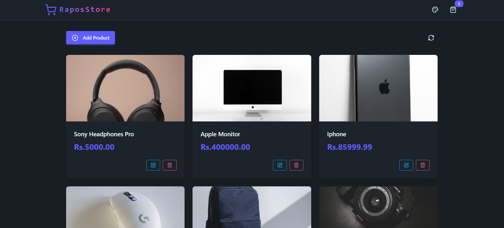

# RaposStore

A full-stack product inventory app built with React, Vite, Express, and NeonDB(An online postreSQL database). Main purpose of building this project to learn Rate-limiting and bot-detection.

---



## Features

- <b>Rate limiting(applied Token Bucket Algorithm) and Bot protection with Arcjet</b>
- Product listing, creation, editing, and deletion
- Modern UI with Tailwind CSS and DaisyUI
- Persistent theme selection
- RESTful API with Express and NeonDB

## Project Structure

```
.
├── backend/
│   ├── config/
│   ├── controllers/
│   ├── lib/
│   ├── routes/
│   ├── seeds/
│   └── server.js
├── frontend/
│   ├── public/
│   ├── src/
│   ├── index.html
│   └── package.json
├── .env
├── package.json
└── README.md
```

## Getting Started

### 1. Clone the repository

```sh
git clone https://github.com/yourusername/raposstore.git
cd raposstore
```

### 2. Setup environment variables

Copy `.env.example` to `.env` and fill in your database and Arcjet credentials.

### 3. Install dependencies

```sh
npm install
cd frontend
npm install
cd ..
```

### 4. Seed the database (optional)

```sh
node sampleProducts.js
```

### 5. Run the development server

```sh
npm run dev
```

## API Endpoints

- `GET /api/products` - List all products
- `POST /api/products` - Create a new product
- `GET /api/products/:id` - Get a product by ID
- `PUT /api/products/:id` - Update a product
- `DELETE /api/products/:id` - Delete a product

